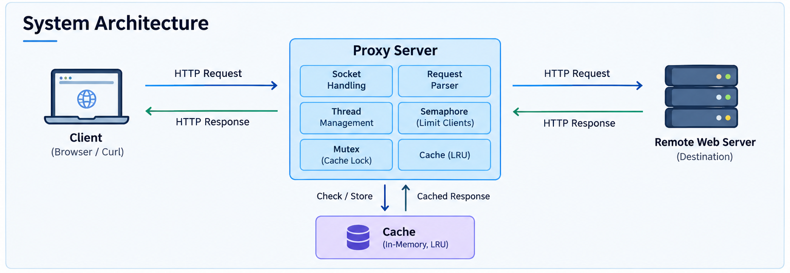
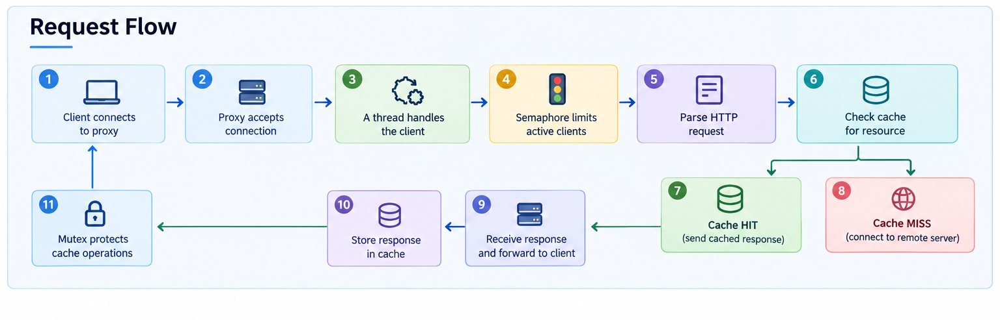

# Multithreaded Proxy Web Server in C

A multithreaded HTTP proxy server built from scratch in C to understand **socket programming, HTTP communication, multithreading, synchronization, and caching** at a lower level.

The proxy accepts client requests, parses HTTP requests, forwards them to the destination server, sends the response back to the client, and caches responses for subsequent requests.

## Features

* TCP socket-based HTTP proxy
* Multithreaded client handling using POSIX threads
* Semaphore for limiting concurrent clients
* Mutex for thread-safe cache access
* HTTP request parsing
* In-memory response cache
* LRU-style cache eviction
* Makefile-based build

## Architecture



The basic communication flow is:

**Client → Proxy → Remote Server → Proxy → Client**

For a cached resource:

**Client → Proxy → Cache → Client**

## How It Works



1. The proxy starts a TCP listening socket.
2. A client connects and the proxy accepts the connection.
3. A separate thread handles the client request.
4. A semaphore limits the number of clients being processed concurrently.
5. The HTTP request is parsed to extract the required information.
6. The proxy checks whether the requested resource exists in the cache.
7. If it is a cache hit, the stored response is sent to the client.
8. If it is a cache miss, the proxy connects to the destination server.
9. The response is received and forwarded to the client.
10. The response can be stored in the cache for future requests.
11. A mutex protects shared cache operations from concurrent access.

## Concurrency

The server follows a **thread-per-client** approach.

```c
#define MAX_CLIENTS 10
```

A semaphore is used to limit the number of clients that can be actively processed at the same time.

The shared cache is protected using a mutex.

**Semaphore:** controls concurrency
**Mutex:** protects shared data

## Caching

The proxy maintains an in-memory cache implemented using a linked list.

Current limits:

* Maximum cache size: **200 MB**
* Maximum individual cached response: **10 KB**
* LRU-style eviction based on access time

Caching allows frequently requested resources to be served without making another request to the remote server.

## Project Structure

```text
Multithreaded-Proxy-Web-Server-in-C/
│
├── proxy_server_with_cache.c
├── proxy_parse.c
├── proxy_parse.h
├── Makefile
└── images/
    ├── proxy-architecture.png
    └── proxy-workflow.png
```

## Build and Run

Clone the repository:

```bash
git clone https://github.com/AkhileshAher/Multithreaded-Proxy-Web-Server-in-C.git
cd Multithreaded-Proxy-Web-Server-in-C
```

Build:

```bash
make
```

Run the proxy:

```bash
./proxy 8080
```

Test using cURL:

```bash
curl -x http://localhost:8080 http://example.com
```

## What I Learned

Working on this project helped me understand how several concepts come together at the systems level:

* TCP socket programming
* HTTP request/response handling
* POSIX threads
* Semaphores and mutexes
* Shared memory and synchronization
* Dynamic memory management
* Cache design and eviction
* Client-server communication

## Future Improvements

* HTTPS `CONNECT` support
* Thread pool instead of creating a thread per request
* Hash-map based cache lookup
* O(1) LRU cache
* Non-blocking sockets
* Persistent HTTP connections
* Support for additional HTTP methods
* Automated testing

## Author

**Akhilesh Aher**

[GitHub](https://github.com/AkhileshAher)
